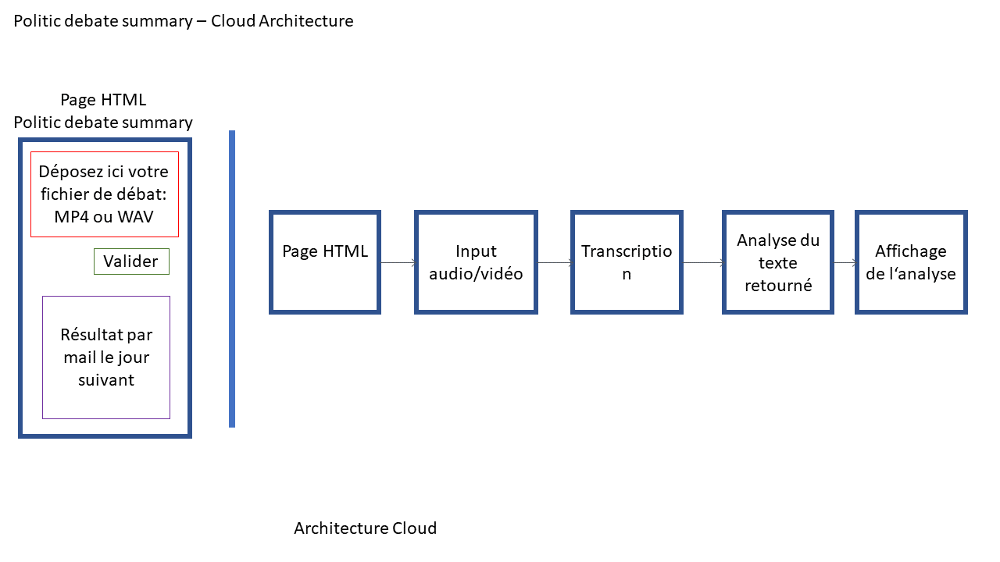
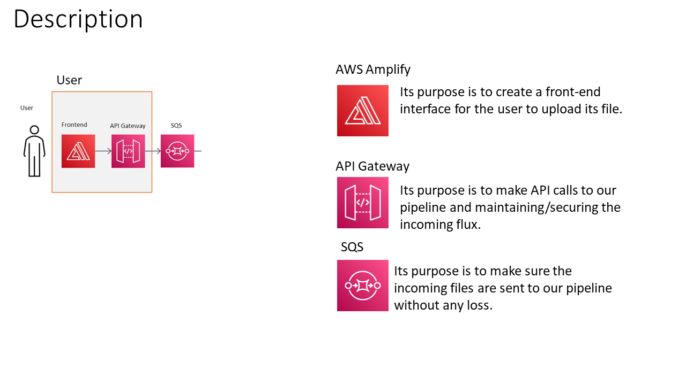
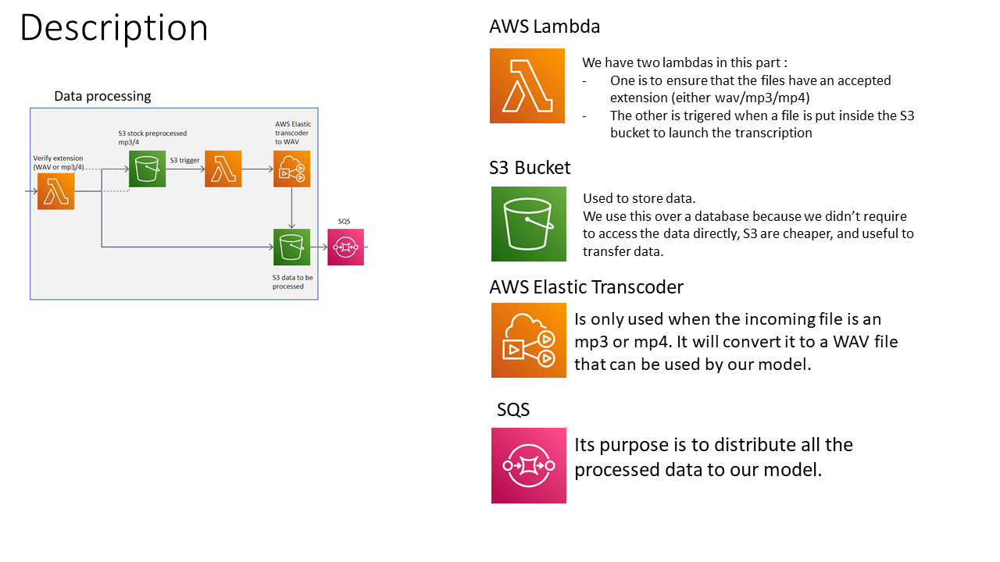
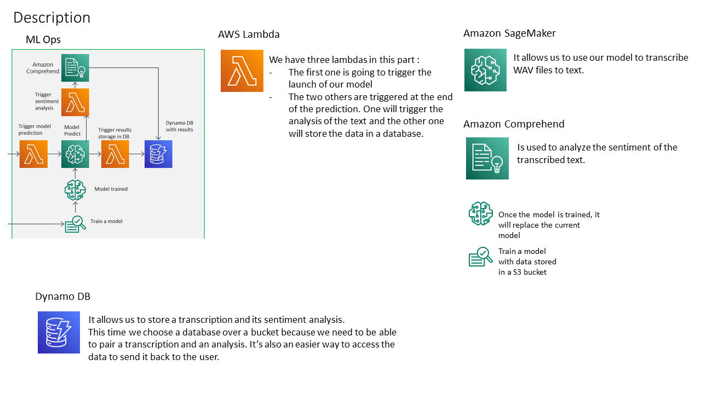
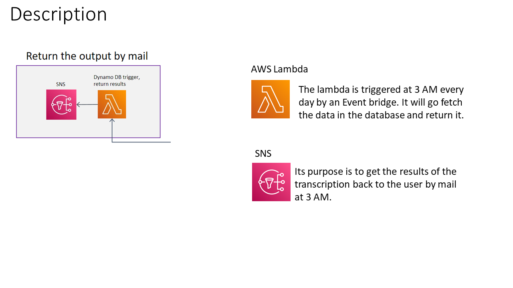
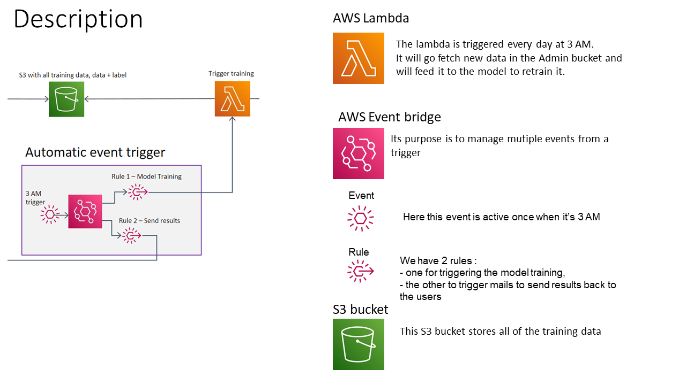
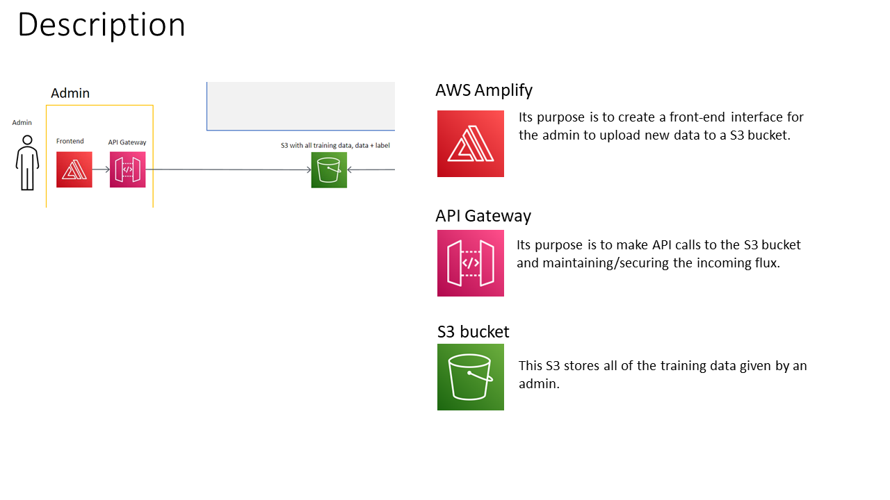
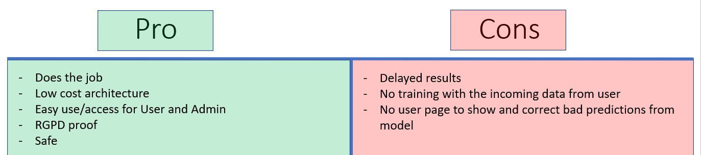

# DAT_Politic_debate_summary

Participants : Tristan Chevet, Emilie Roux and Norbert Astier

Our project subject is the analysis of french political debate.
The user provides to the webpage a debate in wav/mp4/mp3.
Then the architecture will provide a transcription and a sentiment analysis of the debate by email.

